```
   _____                      __  ______            __
  / ___/____ ___  ____ ______/ /_/ ____/___  _____ / /_
  \__ \/ __ `__ \/ __ `/ ___/ __/ /   / __ `/ ___/_ _ /
 ___/ / / / / / / /_/ / /  / /_/ /___/ /_/ / /   / /__
/____/_/ /_/ /_/\__,_/_/   \__/\____/\__,_/_/    \___/
```

# SmartCart

SmartCart is a Flutter-based self-checkout platform for grocery retailers. The mobile app handles scanning, carting, and payments; the web admin dashboard manages inventory, orders, users, and analytics. Backend is powered by Firebase.

## Workflow Diagram

```mermaid
graph TD
    %% SmartCart Comprehensive Workflow Diagram
    
    subgraph "App Launch & Authentication"
        START([App Launch]) --> AUTH{Authenticated?}
        AUTH -->|No| ONBOARD[Onboarding]
        ONBOARD --> LOGIN[Login<br/>Google OAuth]
        LOGIN --> AUTH_SUCCESS{Login Success?}
        AUTH_SUCCESS -->|No| LOGIN
        AUTH_SUCCESS -->|Yes| ROLE_CHECK{User Role?}
    end
    
    subgraph "Customer Journey"
        ROLE_CHECK -->|Customer| HOME[Home Screen<br/>Bottom Navigation]
        
        HOME --> STORE[Browse Store<br/>Products Grid]
        HOME --> CART[Shopping Cart<br/>Items Management]
        HOME --> PROFILE[User Profile<br/>Settings & Info]
        HOME --> ANALYTICS[Spending Analytics<br/>Budget Tracking]
        
        STORE --> SEARCH[Search Products<br/>Text + Voice]
        STORE --> SCAN[Barcode Scanner<br/>Camera Integration]
        SCAN --> SCAN_RESULT{Product Found?}
        SCAN_RESULT -->|Yes| ADD_TO_CART[Add to Cart<br/>Stock Validation]
        SCAN_RESULT -->|No| SCAN_RETRY[Retry Scan<br/>Error Feedback]
        ADD_TO_CART --> CART
        
        CART --> MODIFY_CART[Edit Cart<br/>Qty/Remove Items]
        MODIFY_CART --> CHECKOUT[Checkout Process<br/>Order Summary]
        CHECKOUT --> PAYMENT_SELECT[Payment Method<br/>UPI/COD/Card]
        PAYMENT_SELECT --> PROCESS_PAYMENT[Payment Processing<br/>Secure Transaction]
        PROCESS_PAYMENT --> PAYMENT_STATUS{Payment Status}
        PAYMENT_STATUS -->|Success| ORDER_CREATED[Order Created<br/>Order ID Generated]
        PAYMENT_STATUS -->|Failed| PAYMENT_RETRY[Retry Payment<br/>Error Handling]
        
        ORDER_CREATED --> ORDER_TRACKING[Order Tracking<br/>Real-time Status]
        ORDER_TRACKING --> ORDER_HISTORY[Order History<br/>Past Purchases]
        
        PROFILE --> EDIT_INFO[Edit Personal Info<br/>Name/Address/Phone]
        PROFILE --> PAYMENT_METHODS[Saved Payment Methods<br/>Cards Management]
        PROFILE --> SHIPPING_ADDR[Shipping Addresses<br/>Multiple Locations]
        PROFILE --> LOYALTY_PROG[Loyalty Program<br/>Points & Rewards]
        PROFILE --> APP_SETTINGS[App Settings<br/>Theme/Notifications]
        
        HOME --> NOTIFICATIONS[Notifications<br/>In-app Messages]
        HOME --> FEEDBACK[Submit Feedback<br/>Rate Experience]
        HOME --> REPORT_BUG[Report Issues<br/>Bug Tracking]
    end
    
    subgraph "Admin Dashboard (Web)"
        ROLE_CHECK -->|Admin| ADMIN_DASH[Admin Dashboard<br/>Statistics Overview]
        
        ADMIN_DASH --> PROD_MGMT[Product Management<br/>Inventory Control]
        ADMIN_DASH --> ORDER_MGMT[Order Management<br/>Fulfillment]
        ADMIN_DASH --> USER_MGMT[User Management<br/>Account Control]
        ADMIN_DASH --> NOTIFY_USERS[Send Notifications<br/>Broadcast Messages]
        ADMIN_DASH --> VIEW_FEEDBACK[Customer Feedback<br/>Reviews & Ratings]
        ADMIN_DASH --> BUG_MGMT[Bug Reports<br/>Issue Resolution]
        ADMIN_DASH --> BUSINESS_ANALYTICS[Analytics Dashboard<br/>Performance Metrics]
        
        PROD_MGMT --> ADD_PRODUCT[Add New Product<br/>Details/Barcode/Stock]
        PROD_MGMT --> EDIT_PRODUCT[Edit Product Info<br/>Update Details]
        PROD_MGMT --> DELETE_PRODUCT[Remove Product<br/>Archive/Confirm]
        PROD_MGMT --> BULK_IMPORT[Import/Export CSV<br/>Bulk Operations]
        
        ORDER_MGMT --> VIEW_ALL_ORDERS[View All Orders<br/>Filter/Search]
        VIEW_ALL_ORDERS --> UPDATE_ORDER_STATUS[Update Status<br/>Processing → Delivered]
        UPDATE_ORDER_STATUS --> NOTIFY_CUSTOMER[Notify Customer<br/>Status Updates]
        
        USER_MGMT --> VIEW_USERS[List All Users<br/>Account Details]
        VIEW_USERS --> MODIFY_USER_ACCESS[Change User Roles<br/>Admin/Customer]
        MODIFY_USER_ACCESS --> SUSPEND_ACCOUNT[Suspend/Restore<br/>Account Control]
        
        NOTIFY_USERS --> CREATE_MESSAGE[Compose Message<br/>Target Selection]
        CREATE_MESSAGE --> SEND_BROADCAST[Send Broadcast<br/>Firebase Messaging]
        SEND_BROADCAST --> TRACK_DELIVERY[Track Delivery<br/>Success Metrics]
    end
    
    subgraph "Firebase Backend Services"
        FIREBASE[(Firebase Ecosystem)]
        
        FIREBASE --> AUTH[Firebase Auth<br/>Google OAuth<br/>User Management]
        FIREBASE --> FIRESTORE[(Firestore DB<br/>Real-time Sync<br/>Offline Support)]
        FIREBASE --> MESSAGING[Firebase Messaging<br/>Push Notifications<br/>In-app Alerts]
        FIREBASE --> ANALYTICS[Firebase Analytics<br/>User Behavior<br/>Event Tracking]
        FIREBASE --> CRASHLYTICS[Crashlytics<br/>Error Reporting<br/>Crash Monitoring]
        
        AUTH --> ROLE_CHECK
        FIRESTORE --> ADD_TO_CART
        FIRESTORE --> ORDER_CREATED
        FIRESTORE --> EDIT_INFO
        FIRESTORE --> PROD_MGMT
        FIRESTORE --> ORDER_MGMT
        FIRESTORE --> USER_MGMT
        MESSAGING --> NOTIFICATIONS
        MESSAGING --> SEND_BROADCAST
        ANALYTICS --> ANALYTICS
        ANALYTICS --> BUSINESS_ANALYTICS
        CRASHLYTICS --> REPORT_BUG
    end
    
    subgraph "Security & Data Protection"
        SECURITY[Security Rules<br/>Role-based Access<br/>Data Isolation]
        SECURITY --> FIRESTORE
        SECURITY --> AUTH
        
        ENCRYPTION[Data Encryption<br/>Secure Transmission<br/>Privacy Protection]
        ENCRYPTION --> FIRESTORE
        ENCRYPTION --> MESSAGING
    end
    
    %% Flow connections
    ORDER_HISTORY --> HOME
    ANALYTICS --> HOME
    NOTIFICATIONS --> HOME
    PROFILE --> HOME
    BUSINESS_ANALYTICS --> ADMIN_DASH
    BUG_MGMT --> ADMIN_DASH
    VIEW_FEEDBACK --> ADMIN_DASH
    
    %% Styling for better visualization
    classDef startNode fill:#e8f5e8,stroke:#2e7d32,stroke-width:3px
    classDef authNode fill:#e3f2fd,stroke:#1565c0,stroke-width:2px
    classDef customerNode fill:#f3e5f5,stroke:#7b1fa2,stroke-width:2px
    classDef adminNode fill:#fff3e0,stroke:#f57c00,stroke-width:2px
    classDef backendNode fill:#e8f5e8,stroke:#2e7d32,stroke-width:2px
    classDef securityNode fill:#ffebee,stroke:#c62828,stroke-width:2px
    classDef decisionNode fill:#fce4ec,stroke:#ad1457,stroke-width:2px
    
    class START startNode
    class AUTH,AUTH_SUCCESS,ROLE_CHECK,SCAN_RESULT,PAYMENT_STATUS decisionNode
    class ONBOARD,LOGIN,HOME,STORE,CART,PROFILE,ANALYTICS,SEARCH,SCAN,ADD_TO_CART,MODIFY_CART,CHECKOUT,PAYMENT_SELECT,PROCESS_PAYMENT,ORDER_CREATED,ORDER_TRACKING,ORDER_HISTORY,EDIT_INFO,PAYMENT_METHODS,SHIPPING_ADDR,LOYALTY_PROG,APP_SETTINGS,NOTIFICATIONS,FEEDBACK,REPORT_BUG customerNode
    class ADMIN_DASH,PROD_MGMT,ORDER_MGMT,USER_MGMT,NOTIFY_USERS,VIEW_FEEDBACK,BUG_MGMT,BUSINESS_ANALYTICS,ADD_PRODUCT,EDIT_PRODUCT,DELETE_PRODUCT,BULK_IMPORT,VIEW_ALL_ORDERS,UPDATE_ORDER_STATUS,NOTIFY_CUSTOMER,VIEW_USERS,MODIFY_USER_ACCESS,SUSPEND_ACCOUNT,CREATE_MESSAGE,SEND_BROADCAST,TRACK_DELIVERY adminNode
    class FIREBASE,FIRESTORE,AUTH,MESSAGING,ANALYTICS,CRASHLYTICS backendNode
    class SECURITY,ENCRYPTION securityNode
```



## Highlights
- Mobile app: barcode scanning, stock-aware cart, voice/haptics, dark UI
- Admin web: product/order/user management, notifications, analytics
- Backend: Firebase Auth, Firestore, Messaging, Analytics, Crashlytics
- Quality gates: test suite (76 tests), Flutter analyze, `publish_check.ps1` gatekeeper, CI on GitHub Actions

## Tech Stack
- Flutter 3.38.6 (Dart 3.x), Material 3, Provider
- Firebase: Auth, Firestore, Messaging, Analytics, Crashlytics
- Tooling: GitHub Actions (Flutter), `publish_check.ps1`

## Quick Start
1) Prereqs: Flutter 3.38.6+, Android SDK 33+, Firebase CLI (optional)
2) Install:
```bash
git clone https://github.com/yourusername/SmartCart.git
cd SmartCart
flutter pub get
```
3) Firebase:
- Add `android/app/google-services.json`
- Ensure `lib/firebase_options.dart` matches your project (FlutterFire CLI)
4) Run:
```bash
flutter analyze
flutter test
flutter run
```

## Testing
- Suite: 76 unit/integration tests (see `test/`)
- Commands:
```bash
flutter test
flutter test test/models_test.dart
flutter test integration_test/
```

## Release Gatekeeper
Run before shipping:
```powershell
./publish_check.ps1
```
What it does: env/file checks, per-file tests + full suite, analyze, optional widget/coverage, security scan, release APKs (split per ABI) with SHA256 and `build_info.json`.

## CI/CD
- GitHub Actions: Flutter setup (subosito/flutter-action), `flutter pub get`, `flutter analyze`, `flutter test`
- Daily scheduled run at 03:00 UTC (manual dispatch available)

## Build & Ship
- Debug: `flutter build apk --debug`
- Release: `flutter build apk --release --split-per-abi`
- Scripted: `./publish_check.ps1` → upload APKs from `releases/PROD_BUILD_*`

## Security & Access
- Auth: Google Sign-In required
- Admin whitelist: admin1@example.com, admin2@example.com
- Firestore: user data isolated under `/users/{userId}/`; role-based writes

## Troubleshooting
- No tests run: `flutter test --verbose` and check `publish_check.ps1` output
- Firebase issues: confirm `google-services.json` path and `firebase_options.dart`
- CI issues: ensure workflow uses Flutter commands (not Dart)

## License
Proprietary. All rights reserved.
- **Accessibility**: Inclusive design for all users
- **Economic Impact**: Supports local businesses with technology

## Additional Information

### Security Features
- **Google OAuth**: Secure authentication for users and admins
- **Email Whitelisting**: Admin access restricted to authorized emails only
  - Hardcoded admin emails: `admin1@example.com`, `admin2@example.com`
  - Admin verification via Firebase Authentication token
  - Unauthorized accounts automatically signed out
- **Firestore Security Rules**: Comprehensive data access protection
  - User data isolation under `/users/{userId}/`
  - userId validation on all write operations
  - Read permissions based on ownership and admin status
  - Query-level security enforced
- **Real-time Encryption**: Secure data transmission via Firebase
- **Authentication Requirements**: All app features require sign-in
- **Password-less Authentication**: Google Sign-In for enhanced security
- **Role-Based Access Control**: Distinct permissions for users vs admins
- **Data Privacy**: Users cannot access other users' personal information

### Admin Configuration

**To Add New Admin Users:**
1. Open `firestore.rules` file
2. Locate the `isAdmin()` function
3. Add new admin email to the list:
   ```javascript
   function isAdmin() {
     return isSignedIn() && 
       (request.auth.token.email == 'admin1@example.com' || 
        request.auth.token.email == 'admin2@example.com' ||
        request.auth.token.email == 'newemail@example.com');
   }
   ```
4. Deploy updated rules: `firebase deploy --only firestore:rules`
5. Update `web/admin.html` whitelist (around line 865):
   ```javascript
   const ALLOWED_EMAILS = [
     'admin1@example.com', 
     'admin2@example.com',
     'newemail@example.com'
   ];
   ```
6. Deploy web: `firebase deploy --only hosting`

**Admin Panel Access:**
- URL: https://shrs425.web.app
- Sign in with whitelisted Google account
- Non-admin accounts show "Access Denied" message
- Real-time data synchronization without page refresh

**Admin Panel Tabs:**
1. **Dashboard** - Overview statistics (revenue, orders, users, alerts)
2. **Products** - Complete product catalog management (CRUD operations)
3. **Orders** - View and manage all customer orders
4. **Users** - User database and account management
5. **Notify** - Send broadcast notifications to all users
6. **Feedbacks** - Review customer feedback and ratings
7. **Bug Reports** - Track and manage reported issues
8. **Analytics** - Business intelligence and performance metrics

### Performance Optimizations
- **Lazy Loading**: Products loaded in pages
- **Caching**: Local data storage for offline access
- **Image Optimization**: Efficient emoji-based product display
- **Background Processing**: Non-blocking operations

### Future Enhancements
- **AI Recommendations**: Personalized product suggestions
- **AR Features**: Augmented reality product visualization
- **IoT Integration**: Smart shelf integration
- **Multi-language Support**: International expansion
- **Loyalty Program**: Rewards and points system
- **And Many More

### Support and Contact
- **GitHub Repository**: https://github.com/shrs425p/SmartCart
- **Issues & Bug Reports**: https://github.com/shrs425p/SmartCart/issues
- **Discussions**: https://github.com/shrs425p/SmartCart/discussions
- **Email**: en24309314@git.india.edu.in
- **Institution**: Gharda Institute of Technology

*Note: For Firebase configuration and deployment setup, refer to the example files in the repository.*

### ⚠️ License

**© 2026 Shreyas Sanjay Pawar. All Rights Reserved.**

This software, **"SmartCart,"** is the proprietary intellectual property of 
Shreyas Sanjay Pawar. Unauthorized copying, distribution, modification, or 
commercial use is strictly prohibited.

**This project is developed for educational purposes at Gharda Institute of Technology.**

**For licensing inquiries or permission requests, contact:**
- **Email**: en24309314@git.india.edu.in
- **Institution**: Gharda Institute of Technology

**Note**: This is a proprietary license, not an open-source license like MIT, Apache, or GPL.

---

## 🚀 Recent Additions & Improvements (2026)

### ✨ UI/UX Polish
- **Staggered Animations**: Smooth, sequential entrance animations for lists and grids across the app (Store, Cart, Order History, Analytics, etc.)
- **Global Page Transitions**: Native-feeling navigation transitions (Zoom for Android, Cupertino for iOS)
- **Skeleton Loading (Shimmer)**: Modern shimmer placeholders for product grids while loading
- **Haptic Feedback**: Subtle vibration feedback for key actions (requires Android permission)

### 🗣️ Smart Features
- **Voice Search**: Tap the microphone in the Store search bar to filter products by speaking (uses on-device speech recognition)

### 🛡️ Quality & Testing
- **Expanded Unit Tests**: New tests for data models and business logic (see `test/models_test.dart`)
- **Automated Publish Script**: `publish_check.ps1` now checks for critical test files, runs all tests, and organizes APKs with checksums for release

### 🛠️ Bug Fixes & Refactors
- **Order History**: Fixed text visibility for dark/light mode, removed hardcoded SHA keys from Diagnostics
- **Notifications**: New notifications screen with animated list
- **Profile**: Cleaned up unused code and improved maintainability

---
